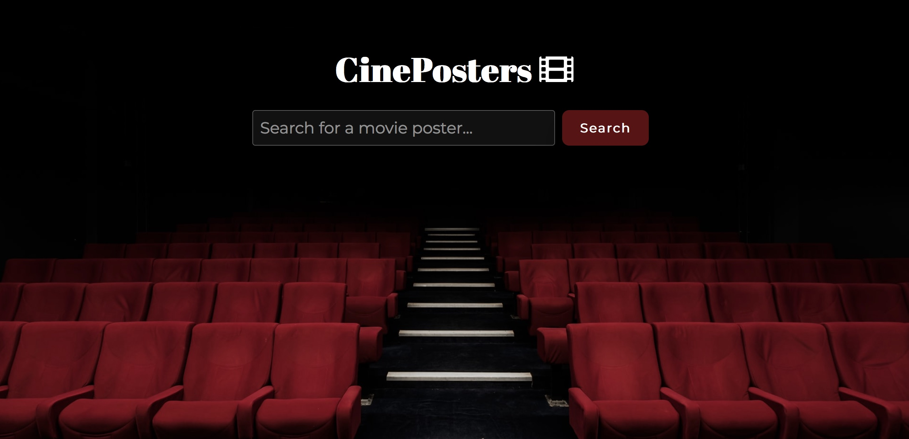

# CinePosters - Movie Poster Search
Simple movie poster search app that uses the Open Movie Database (OMDB) API to display movie posters corresponding to search. 

## Installation
1. Clone the repo\
git clone https://github.com/malin-nilsson/movie-posters.git

2. Install npm packages\
npm install

3. Run Parcel\
npm run build

Visit localhost:1234 to view the project

## Built with
- HTML
- SASS
- Parcel
- NPM
- TypeScript
- API
- Mobile-first workflow
- 
## Useful resources
OMDb API:
http://www.omdbapi.com/

## Author
- GitHub - [malin-nilsson](https://github.com/malin-nilsson)

## Acknowledgments
Photo by Felix Mooneeram on Unsplash:
https://unsplash.com/photos/evlkOfkQ5rE
  

